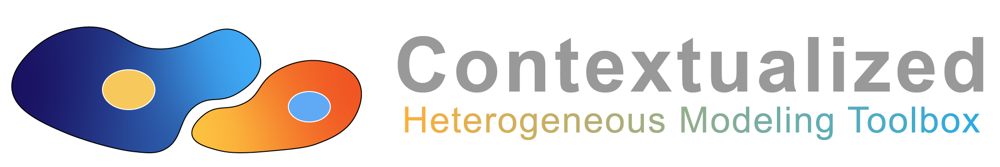

# Summary

Complex, heterogeneous, and context-dependent systems are a defining characteristic of biology, medicine, finance, and the social sciences, and more generally any field that focuses on understanding real-world systems from observational data.
Distilling data into accurate and interpretable models of these systems provides fundamental insights about these systems' behavior, allowing us to predict and manipulate them for human benefit.
Research has traditionally focused on distilling data via statistical tools or deep learning methods, but both are inappropriate for modeling heterogeneous and context-dependent systems.
Statistical tools are inaccurate for heterogeneous data, being too inflexible to capture nuanced and context-dependent effects, while deep learning frameworks are flexible but inherently uninterpretable, precluding actionable model-based insights.

To address this, we present [`Contextualized ML`](https://contextualized.ml/), an easy-to-use SKLearn-style machine learning toolbox for estimating and analyzing context-dependent models at per-sample resolution.
`Contextualized ML` uses a synergy of deep learning and statistical modeling to infer sample-specific models using sample contexts or metadata, providing individualized model-based insights for each sample, and representing heterogeneity in data through variation in sample-specific model parameters.
We do this by introducing two reusable concepts: *a context encoder* which translates sample context or metadata into model parameters, and *sample-specific model* which is defined by the context-specific parameters.
Our formulation unifies a wide variety of popular modeling approaches, including simple population modeling, sub-population modeling, (latent) mixture modeling, cluster modeling, time-varying models, and varying-coefficient models [@hastie1993varying], and conveniently defaults to the most appropriate type of traditional model when complex heterogeneity is not present.
Notably, `Contextualized ML` also permits context-specific modeling even when the number of contexts vastly exceeds the number of observed samples, superceding previous frameworks by enabling even sample-specific modeling with no loss of statistical power.

`Contextualized ML` is a lean, utility-oriented implementation of the broader Contextualized Machine Learning paradigm [@lengerich_contextualized_2023], focusing on the most important, novel, and popular use cases from recent works developing contextualized models [@ellington_contextualized_2023, @deuschel_contextualized_2023, @lengerich_notmad_2021, @al-shedivat_contextual_2020, @lengerich_automated_2022, @lengerich_discriminative_2020, @al-shedivat_personalized_2018].
We provide `Contextualized ML` as a Python package written in native PyTorch with a simple SKLearn-style interface.

**Contextualized ML serves three primary purposes:**

1. It provides a simple plug-and-play interface to learn contextualized versions of most popular model classes (e.g. linear regression, classifiers, graphical models, Gaussians).
2. It enables immediate results with intuitive analysis tools to understand, quantify, test, and visualize data with heterogeneous and context-dependent behavior.
3. It provides a highly extensible and modular framework for researchers to develop new contextualized models.

{width=90%}

# Popular Use Cases
Traditionally, contextual factors might be controlled for by splitting data into many context-specific groups, but this quickly limits statistical power and model accuracy as the number of contexts increases, and in real data the number of possible contexts can vastly exceed the amount of data available.
For example, there are 11,500,000 known single-nucleotide polymorphisms in humans, implying $2^{11,500,000}$ genetic contexts, but only about $2^{37}$ people have ever existed.

`Contextualized ML` unifies and supercedes a wide variety of popular modeling approaches, including simple population modeling, sub-population modeling, (latent) mixture modeling, cluster modeling, time-varying models, and varying-coefficient models.
`Contextualized ML` further supercedes these frameworks, permitting even sample-specific modeling without losing statistical power.

Previous cluster or cohort-based methods infer a single statistical model that is shared amongst all the samples in a (sub)population, implicitly assuming that intra-cluster or intra-cohort samples are homogeneous and identically distributed.
This simplifies the resulting mathematical models, but ignores heterogeneity -- as a result, models which use homogeneous effects to mimic heterogeneous phenomena force users to pick *either* model flexibility or parsimony.

In contrast, *contextualized* models adapt to the context of each sample (\autoref{fig:paradigm}).
`ContextualizedML` models the effects of contextual information on models through a context encoder, translating sample contexts into sample-specific models.
By embracing heterogeneity and context-dependence, contextualized learning provides representational capacity while retaining the glass-box nature of statistical modeling.

{width=100%}

# Benefits
Both components are highly adaptable; the context encoder can be replaced with any differentiable function, and any statistical model with a differentiable likelihood or log-likelihood can be contextualized and made sample-specific.

This framework exhibits desirable properties, such as its ability to infer sample-specific models without losing power by splitting data into many subgroups, incorporate multiple data modalities via context encoding, explicitly test for heterogeneity in real data, while automatically defaulting to the most appropriate type of traditional model when complex heterogeneity is not present.

Contextualized machine learning has several advantages over partition-based analyses:

- By sharing information between all contexts, contextualized learning is able to estimate heterogeneity at fine-grained resolution.
- By learning to translate contextual information into model parameters, contextualized models learn about the meta-distribution of contexts. At test time, contextualized models can adapt to contexts which where never observed in the training data, either by interpolating between observed contexts or extrapolating to new domain of context.
- By associating structured models with each sample, contextualized learning enables analysis of samples with latent processes.

Detailed documentation is available at [contextualized.ml/docs](https://contextualized.ml/docs).

# Acknowledgements

We are grateful for early user input from Juwayni Lucman, Alyssa Lee, and Jannik Deuschel.

# References
